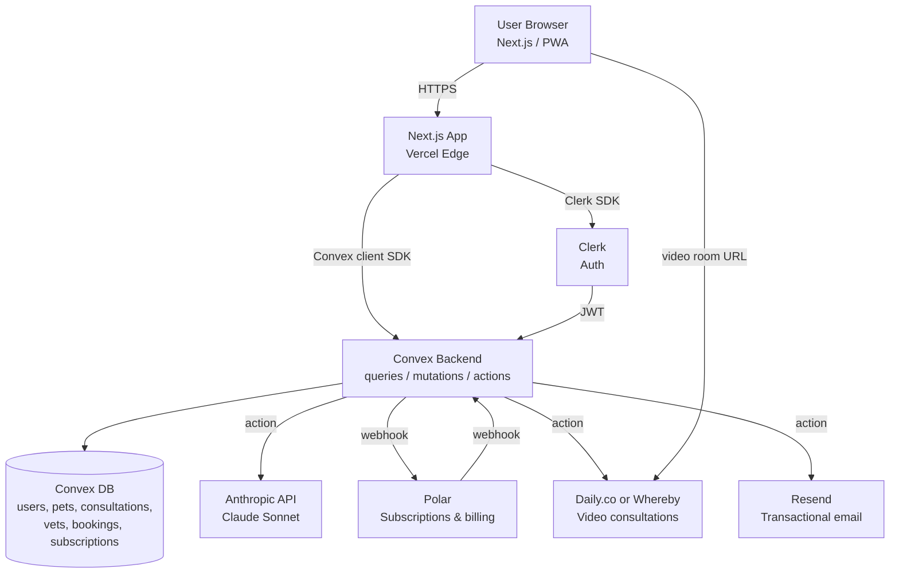

# PRD — Tranqui

## 1. Overview

### Product Summary

**Tranqui** is an AI-powered veterinary assistant for dog and cat owners. The product one-liner: *"Tu asistente veterinario 24/7: orientación inmediata y consulta con un veterinario aliado cuando hace falta."*

The application provides an LLM-driven chat agent that conducts structured anamnesis on pet symptoms, returns a probabilistic clinical analysis with home-care guidance, and classifies every case into one of three triage levels (URGENTE / PREFERENTE / ORIENTATIVO). For non-trivial cases, users can book a same-day 20-minute video consultation with a partnered veterinarian who receives the case fully pre-loaded with context. The product is targeted at the Spanish market initially, with a UI and content fully in Spanish (Spain).

### Objective

This PRD covers the **MVP (v1)** as scoped in `docs/product-vision.md` § Product Strategy → MVP Definition. Specifically, the in-scope features:

1. Symptomatic consultation 24/7 with directed anamnesis.
2. Three-level clinical triage with conditional referral.
3. Persistent pet profile with consultation history.
4. Booking of 20-minute video consultations with partnered veterinarians.
5. Subscription billing (free tier limited to 3 IA consultations + paid tier at €9.99/mo).
6. Clear medical-legal disclaimer surfaced in every consultation.

Explicitly excluded from this PRD (deferred to v2 or later, see § 14): photo upload of symptoms, voice input, native mobile apps, proactive vaccine reminders, marketplace of recommended products, multi-language beyond Spanish, premium tier with deeper analyses.

### Market Differentiation

Existing telemedicine veterinary services (Barkibu, Pawp, Vetster) start every consultation with a human veterinarian — expensive marginal cost, high latency, and a paywall that blocks the panic moment at 23:00. Tranqui inverts the model: a clinically-grounded AI agent (built on the `skills/agente-veterinario-ia.md` SKILL) handles the first line of contact and resolves the 70-80% of cases that don't require a human, reserving veterinarian time only for cases where it genuinely matters. The technical implementation must deliver three things to make this real: (1) a fast, streaming chat experience that feels responsive at the panic moment, (2) clinically-rigorous triage that the user can trust and that a partnered vet finds credible enough to receive a pre-loaded case, and (3) tight LLM cost control so the €9.99/month subscription stays profitable.

### Magic Moment

The magic moment is: **a worried owner gets a clear, trustworthy answer plus an actionable next step in under 3 minutes, without leaving home.**

The technical requirements that enable it:

- **Time-to-first-token (TTFT) of the LLM response < 2 seconds** — the user sees streaming begin before they have time to second-guess.
- **Structured anamnesis flow** that asks at most 3-5 follow-up questions before delivering analysis.
- **Final analysis card** with three visible parts: probable causes ordered by likelihood, concrete next-step instructions, urgency level with color-coded badge.
- **Always-visible disclaimer** at the start of every conversation and as a footer on the analysis card.
- **One-click booking** of a video consultation when triage level is PREFERENTE or URGENTE.
- **Free path through the magic moment without authentication friction** — first consultation must be completable with only an email captured at the end (or skipped entirely for the URGENTE path).

### Success Criteria

Technical "done" definitions for the MVP:

- Time-to-first-token (chat) **< 2 seconds** at p95.
- Time-to-magic-moment (sign-up → first analysis) **< 3 minutes** at p50.
- Page load (LCP) **< 2.5 seconds** on 4G mobile, **< 1.5 seconds** on broadband.
- Average LLM cost per completed consultation **< €0.03**.
- All P0 functional requirements implemented with manual end-to-end test pass.
- WCAG 2.1 AA compliance on all production pages.
- Zero unhandled exceptions on the happy paths in production logs over 7 consecutive days.
- Clinical SKILL audited on a sample of the first 200 production conversations by the clinical advisor; ≥85% appropriate-triage rate.

-----

## 2. Technical Architecture

### Architecture Overview



### Chosen Stack

| Layer | Choice | Rationale |
|---|---|---|
| Frontend | Next.js (App Router, TypeScript) | Best-in-class for streaming AI chat (Server Components + Server Actions), excellent Convex integration, Vercel deploy with generous free tier, broad coding-agent support. |
| Backend | Convex | Real-time reactivity without WebSocket boilerplate, TypeScript end-to-end, document-relational DB with automatic indexing and ACID transactions, file storage built in, generous free tier (1M function calls/mo). |
| Database | Convex Database | Included with Convex backend; reactive queries auto-update UI when data changes; ACID transactions; ideal for the consultation/booking domain. |
| Auth | Clerk | Pre-built UI for signup/login/social, native Convex integration, 10k MAU free tier (more than enough for MVP), organization model usable for shared family accounts. |
| Payments | Polar | Optimized for SaaS subscriptions, **merchant of record** (handles EU VAT automatically — critical operating from Spain), simpler integration than Stripe, fits the TS/Next.js/Convex stack natively. |
| LLM | Anthropic Claude — `claude-sonnet-4` (or current-best Sonnet model) | Strong clinical/medical reasoning, well-suited for structured anamnesis, prompt caching support to lower cost, cost ~€0.01-0.03 per typical consultation. |
| Video | Daily.co (recommended) — fallback Whereby | Embeddable video consultations, free tier covers MVP volume, simple JS SDK, prebuilt UI. |
| Email | Resend | Modern transactional email API with React Email templates, generous free tier (3k emails/mo). |
| Hosting | Vercel (Hobby → Pro when needed) | One-click deploy from GitHub, edge network, automatic preview deployments per PR. |
| Monitoring | Vercel Analytics + Sentry (free tier) | Web vitals + error tracking. |

### Stack Integration Guide

**Setup order (do this in sequence — do NOT skip ahead):**

1. **Initialize repo** with `pnpm create next-app@latest tranqui --typescript --tailwind --app --src-dir`. Choose `pnpm` as the package manager.
2. **Add Convex** with `pnpm dlx convex@latest dev`. This will scaffold `convex/` and start the dev server. Save `NEXT_PUBLIC_CONVEX_URL` and `CONVEX_DEPLOY_KEY` to `.env.local`.
3. **Add Clerk** with `pnpm add @clerk/nextjs @clerk/themes`. Configure Clerk → Convex JWT template per Clerk's official guide. Save `NEXT_PUBLIC_CLERK_PUBLISHABLE_KEY` and `CLERK_SECRET_KEY`.
4. **Wire Clerk into Convex** by adding `convex/auth.config.ts` pointing to the Clerk issuer URL (this enables `ctx.auth.getUserIdentity()` in Convex functions).
5. **Add Polar** with `pnpm add @polar-sh/sdk`. Configure Polar webhook → Convex HTTP action endpoint at `/polar/webhook`.
6. **Add Anthropic** with `pnpm add @anthropic-ai/sdk`. Save `ANTHROPIC_API_KEY` (server-side only — must never be exposed to client). LLM calls go through Convex `action`s, never directly from the client.
7. **Add Daily.co** with `pnpm add @daily-co/daily-js`. Save `DAILY_API_KEY` for room creation (server-side).
8. **Add Resend** with `pnpm add resend react-email @react-email/components`. Save `RESEND_API_KEY`.
9. **Set up Tailwind tokens** per § 9. Design System (extend `tailwind.config.ts` with the cream/sage/coral palette).
10. **Add the clinical SKILL** by reading `skills/agente-veterinario-ia.md` from disk at build time and embedding it into the system prompt of the consultation action.

**Known integration patterns:**

- **Clerk + Convex.** Use the `<ClerkProvider>` at the root layout. Wrap with `<ConvexProviderWithClerk client={convex} useAuth={useAuth}>` so Convex receives the Clerk JWT automatically. Use `useUser()` from Clerk client-side and `ctx.auth.getUserIdentity()` server-side in Convex.
- **Convex + Anthropic streaming.** Streaming the LLM response back to the browser via Convex requires using a Convex `action` that calls the Anthropic SDK with `stream: true`, but Convex actions don't natively stream HTTP responses. The recommended pattern is: the action consumes the stream and *writes deltas to the database* in a `messages` table. The client subscribes via `useQuery` to the conversation, and the UI updates reactively as deltas land. This is the canonical Convex pattern for chat. Keep delta batches small (every ~50 tokens or 200ms) to balance reactivity and write throughput.
- **Polar webhooks.** Polar sends webhooks for subscription events (`subscription.created`, `subscription.updated`, `subscription.canceled`, `order.created`). Receive them via a Convex `httpAction` at `/polar/webhook`, verify the signature, and update the user's `subscription` record in the DB.
- **Daily.co room creation.** Create a one-off Daily room from a Convex `action` server-side when a booking is confirmed; store the `roomUrl` in the booking record. Both user and vet open the same URL when joining.

**Common gotchas:**

- **Never call Anthropic from a Convex `query` or `mutation`** — they have execution-time and side-effect restrictions. Always use `action`s for external API calls.
- **Anthropic API key must never reach the client bundle.** Keep it in Convex env vars only.
- **Clerk publishable key vs secret key.** Only the publishable key goes into `NEXT_PUBLIC_*`. Never put `CLERK_SECRET_KEY` or `ANTHROPIC_API_KEY` in `NEXT_PUBLIC_*`.
- **Convex args validators are mandatory** (per `@convex-dev/eslint-plugin` rule `require-argument-validators`). Always declare `args: { ... }` with `v.*` validators.
- **Use `v.id("tableName")` for foreign keys**, not `v.string()`. The eslint rule `explicit-table-ids` enforces this.
- **All Convex function bodies must run in the Convex runtime** unless explicitly using `"use node"`. Do not import Node-only packages (e.g. `fs`) into default-runtime functions.
- **Polar requires merchant onboarding** — initial setup takes a few business days. Start that in week 1.
- **Daily.co's free tier has a 10k participant-minute monthly cap** — monitor and upgrade to the paid plan before hitting it.

**Required environment variables:**

```env
# Public — exposed to client bundle
NEXT_PUBLIC_CONVEX_URL=
NEXT_PUBLIC_CLERK_PUBLISHABLE_KEY=
NEXT_PUBLIC_POLAR_PRODUCT_ID_MONTHLY=

# Server-side only — Convex env (set via `npx convex env set ...`) and Vercel env
CLERK_SECRET_KEY=
ANTHROPIC_API_KEY=
POLAR_ACCESS_TOKEN=
POLAR_WEBHOOK_SECRET=
DAILY_API_KEY=
RESEND_API_KEY=
SENTRY_DSN=
```

### Repository Structure

```
tranqui/
├── src/
│   ├── app/                         # Next.js App Router
│   │   ├── (marketing)/             # Public pages (landing, pricing, faq, legal)
│   │   │   ├── page.tsx             # Landing
│   │   │   ├── pricing/page.tsx
│   │   │   ├── faq/page.tsx
│   │   │   └── legal/
│   │   │       ├── terms/page.tsx
│   │   │       ├── privacy/page.tsx
│   │   │       └── disclaimer/page.tsx
│   │   ├── (app)/                   # Authenticated app shell
│   │   │   ├── layout.tsx
│   │   │   ├── consult/
│   │   │   │   ├── page.tsx         # Consultation entry — pet selection + new question
│   │   │   │   ├── [consultationId]/page.tsx  # Active conversation
│   │   │   │   └── new/page.tsx     # Free-trial conversation (no auth required)
│   │   │   ├── pets/
│   │   │   │   ├── page.tsx
│   │   │   │   └── [petId]/page.tsx
│   │   │   ├── history/page.tsx
│   │   │   ├── bookings/
│   │   │   │   ├── page.tsx
│   │   │   │   └── [bookingId]/page.tsx
│   │   │   └── settings/
│   │   │       ├── page.tsx
│   │   │       ├── billing/page.tsx
│   │   │       └── household/page.tsx
│   │   ├── (vet)/                   # Vet-side dashboard (separated route group)
│   │   │   ├── layout.tsx
│   │   │   ├── dashboard/page.tsx
│   │   │   └── consultation/[bookingId]/page.tsx
│   │   ├── api/                     # API routes (webhooks only — Convex handles the rest)
│   │   │   └── ... (kept minimal; Convex httpActions preferred)
│   │   ├── layout.tsx
│   │   └── globals.css
│   ├── components/
│   │   ├── ui/                      # Design system primitives (Button, Input, Card, ...)
│   │   ├── chat/                    # Chat-specific components (Message, StreamingMessage, AnamnesisInput, AnalysisCard, TriageBadge, DisclaimerBanner)
│   │   ├── pets/
│   │   ├── bookings/
│   │   ├── billing/
│   │   └── shared/
│   ├── lib/
│   │   ├── triage.ts                # Triage level helpers (color, copy)
│   │   ├── utils.ts                 # cn() and friends
│   │   └── analytics.ts
│   └── styles/
│       └── tokens.css               # CSS variables (colors, spacing, etc.)
├── convex/
│   ├── _generated/                  # Auto-generated by Convex CLI
│   ├── schema.ts                    # Database schema
│   ├── auth.config.ts               # Clerk integration
│   ├── users.ts                     # User CRUD + onboarding
│   ├── pets.ts                      # Pet profiles
│   ├── consultations.ts             # Conversation list, get, create
│   ├── messages.ts                  # Message CRUD inside a consultation
│   ├── ai.ts                        # AI action: anamnesis + final analysis (streaming via DB writes)
│   ├── triage.ts                    # Server-side triage classification helpers
│   ├── vets.ts                      # Veterinarian profiles
│   ├── availability.ts              # Vet availability slots
│   ├── bookings.ts                  # Video consultation bookings
│   ├── subscriptions.ts             # Subscription state per user
│   ├── polarWebhook.ts              # Polar webhook httpAction
│   ├── dailyRooms.ts                # Daily.co room creation action
│   ├── email.ts                     # Resend transactional email actions
│   └── lib/
│       ├── prompt.ts                # System prompt assembly (loads SKILL)
│       └── clinicalSkill.ts         # Loaded SKILL content (string)
├── skills/                          # Static skill content embedded into prompts
│   ├── agente-veterinario-ia.md     # Clinical SKILL (truth source for clinical reasoning)
│   └── convex/                      # (reference only — Convex skills used by coding agent)
├── public/
│   ├── icons/
│   ├── illustrations/
│   └── og-image.png
├── docs/
│   ├── product-vision.md
│   ├── prd.md                       # this file
│   └── product-roadmap.md
├── vision.json
├── tailwind.config.ts
├── next.config.mjs
├── package.json
├── tsconfig.json
├── eslint.config.js                 # @convex-dev/eslint-plugin enabled
├── .env.local                       # Local-only; do not commit
├── .env.example
└── README.md
```

### Infrastructure & Deployment

- **Hosting (web):** Vercel (Hobby tier free; Pro €20/mo when ready). One-click GitHub integration; preview deployments on every PR.
- **Backend:** Convex Cloud (free tier covers MVP usage; paid plan starts at $25/mo when needed).
- **Auth:** Clerk Cloud (free up to 10k MAU).
- **Email:** Resend (free up to 3k emails/mo, then €20/mo for 50k).
- **Domain:** acquire `tranqui.app` or `gettranqui.com` via any registrar (Namecheap, Cloudflare). Configure DNS → Vercel.
- **CI/CD:** Vercel handles build + deploy. Add a GitHub Action that runs `pnpm typecheck && pnpm lint && pnpm test` on every PR before allowing merge.
- **Environments:** `development` (local), `preview` (Vercel preview deploys per PR, pointed at a separate Convex dev deployment), `production` (main branch → Convex prod deployment). Use `npx convex deploy --cmd 'pnpm build'` in CI for production deploys.

### Security Considerations

- **Authentication.** All routes under `(app)/` and `(vet)/` are gated by Clerk middleware. Public marketing pages and the free-trial consultation entry are accessible without auth, but creating any persistent record (pet profile, account) requires login.
- **Authorization.** Every Convex query/mutation that operates on user-owned data must check `ctx.auth.getUserIdentity()` and verify ownership before returning or mutating. Veterinarian-only functions check the `role: "vet"` flag on the user record.
- **Input validation.** All Convex function args use `v.*` validators (mandatory). Client-side forms use `react-hook-form + zod` for validation; the same schemas are reused server-side where possible.
- **Rate limiting.** Use the `@convex-dev/rate-limiter` component for: free-tier consultations (max 3 per email per month), AI anamnesis steps (max 30 messages/min per user — abuse guard), booking creation (max 5 per user per day).
- **PII handling.** Pet medical content is sensitive. Encrypt at rest is provided by Convex by default. Do not log message content in plaintext to external monitoring (Sentry should redact); log only metadata (consultationId, userId, timing).
- **GDPR compliance.** User-facing privacy policy + cookie banner (use a minimal one — no third-party trackers in MVP). Data export and deletion flow at `/settings` (in v1, this can be a manual support email; full self-serve by v1.2).
- **Medical-legal disclaimer.** Surfaced (1) at the start of every consultation as a banner the user must implicitly acknowledge by sending the first message, (2) as a footer in the analysis card, and (3) in the legal page `/legal/disclaimer`. Wording must be reviewed by a Spanish veterinary law-aware legal advisor before launch.
- **API key safety.** All third-party API keys live in Convex env (`npx convex env set`) or Vercel server env. Nothing sensitive in `NEXT_PUBLIC_*`.
- **Polar webhooks.** Verify the webhook signature on every event using `POLAR_WEBHOOK_SECRET` before processing.

### Cost Estimate

Monthly cost projection at low scale (under 1,000 active users — typical for first 6 months):

| Service | Free tier covers | Cost above free tier | Estimated monthly cost |
|---|---|---|---|
| Vercel | Hosting + edge for hobby projects | €20/mo Pro (recommended once SLA matters) | €0–20 |
| Convex | 1M function calls / 1GB storage / 1M actions | $25/mo Pro (~€23) | €0–23 |
| Clerk | 10k MAU | $25/mo Pro (~€23) | €0 (well below cap in MVP) |
| Polar | Per-transaction fees only (no flat fee) | 4% + €0.40 per transaction | ~€20 net at €1k MRR (≈100 subs × €9.99) |
| Anthropic Claude (Sonnet) | None — pay per token | ~€0.01–0.03 per consultation | ~€30–60 at 100 subs × ~5 consults/mo with prompt caching |
| Daily.co | 10k participant-minutes/mo | $0.004/participant-min after | €0–10 at MVP volume |
| Resend | 3k emails/mo | €20/mo for 50k | €0 (well below cap in MVP) |
| Sentry | 5k events/mo | €26/mo team tier | €0 |
| Domain | — | ~€12/year | ~€1 |

**Estimated total at 100 paid users / 1k MRR:** ≈ €70–110 / month, comfortably within the founder's €100/month operational budget. The dominant variable cost is Anthropic API spend, which scales with consultation volume — this is the main lever to monitor weekly.

-----

## 3. Data Model

The data model uses Convex's document-relational schema (`convex/schema.ts`). All `_id` and `_creationTime` fields are auto-generated by Convex and are not declared explicitly.

### Entity Definitions

```typescript
// convex/schema.ts
import { defineSchema, defineTable } from "convex/server";
import { v } from "convex/values";

export default defineSchema({
  // ───────────────────────────────────────────
  // users — owners and veterinarians (single table, role-discriminated)
  users: defineTable({
    clerkId: v.string(),                             // Clerk user ID
    email: v.string(),
    name: v.optional(v.string()),
    role: v.union(v.literal("owner"), v.literal("vet"), v.literal("admin")),
    locale: v.optional(v.string()),                  // e.g. "es-ES"
    householdId: v.optional(v.id("households")),     // shared family account
    createdAt: v.number(),
    lastSeenAt: v.optional(v.number()),
  })
    .index("by_clerk_id", ["clerkId"])
    .index("by_email", ["email"])
    .index("by_household", ["householdId"]),

  // households — shared accounts (pareja, familia)
  households: defineTable({
    name: v.string(),                                // "Casa Marta & David"
    ownerUserId: v.id("users"),
    createdAt: v.number(),
  }),

  // pets — owned by household (or by user if no household yet)
  pets: defineTable({
    householdId: v.id("households"),
    name: v.string(),
    species: v.union(v.literal("dog"), v.literal("cat")),
    breed: v.optional(v.string()),
    sex: v.optional(v.union(v.literal("male"), v.literal("female"))),
    neutered: v.optional(v.boolean()),
    birthYear: v.optional(v.number()),               // approximate; full DOB optional
    weightKg: v.optional(v.number()),
    knownAllergies: v.optional(v.string()),          // free text
    photoUrl: v.optional(v.string()),                // Convex file storage URL
    createdAt: v.number(),
    updatedAt: v.number(),
  })
    .index("by_household", ["householdId"]),

  // consultations — a single owner-initiated conversation about one symptom episode
  consultations: defineTable({
    householdId: v.id("households"),
    initiatorUserId: v.id("users"),
    petId: v.id("pets"),
    status: v.union(
      v.literal("anamnesis"),                        // gathering info
      v.literal("analyzed"),                         // analysis returned
      v.literal("escalated"),                        // user opted to book a vet
      v.literal("closed"),
    ),
    triageLevel: v.optional(v.union(
      v.literal("urgente"),
      v.literal("preferente"),
      v.literal("orientativo"),
    )),
    summaryTitle: v.optional(v.string()),            // short title for history list
    finalAnalysisMessageId: v.optional(v.id("messages")),
    createdAt: v.number(),
    closedAt: v.optional(v.number()),
    // Cost tracking
    totalInputTokens: v.optional(v.number()),
    totalOutputTokens: v.optional(v.number()),
    totalCostEur: v.optional(v.number()),
  })
    .index("by_household", ["householdId"])
    .index("by_pet", ["petId"])
    .index("by_initiator", ["initiatorUserId"])
    .index("by_household_and_created", ["householdId", "createdAt"]),

  // messages — chat turns inside a consultation
  messages: defineTable({
    consultationId: v.id("consultations"),
    role: v.union(
      v.literal("user"),
      v.literal("assistant"),
      v.literal("system"),
    ),
    content: v.string(),                             // streamed deltas append until done
    isStreaming: v.boolean(),                        // true while assistant message is being written
    isFinalAnalysis: v.boolean(),                    // marks the structured final card
    structuredAnalysis: v.optional(v.object({
      probableCauses: v.array(v.object({
        title: v.string(),
        likelihood: v.union(
          v.literal("alta"),
          v.literal("media"),
          v.literal("baja"),
        ),
        explanation: v.string(),
      })),
      recommendedActions: v.array(v.string()),
      observationGuidance: v.string(),
      triageLevel: v.union(
        v.literal("urgente"),
        v.literal("preferente"),
        v.literal("orientativo"),
      ),
      escalateAvailable: v.boolean(),
    })),
    createdAt: v.number(),
  })
    .index("by_consultation", ["consultationId", "createdAt"]),

  // veterinarians — extended profile for users with role: "vet"
  veterinarians: defineTable({
    userId: v.id("users"),
    fullName: v.string(),
    licenseNumber: v.string(),                       // colegiado number — must validate
    specialty: v.optional(v.string()),
    bio: v.optional(v.string()),
    photoUrl: v.optional(v.string()),
    timezone: v.string(),                            // e.g. "Europe/Madrid"
    isActive: v.boolean(),
    revenueShareBps: v.number(),                     // basis points (6000 = 60%)
    createdAt: v.number(),
  })
    .index("by_user", ["userId"])
    .index("by_active", ["isActive"]),

  // availability slots — bookable 30-min windows (20-min consultation + 10-min buffer)
  availabilitySlots: defineTable({
    veterinarianId: v.id("veterinarians"),
    startsAt: v.number(),                            // Unix ms
    endsAt: v.number(),
    status: v.union(
      v.literal("open"),
      v.literal("booked"),
      v.literal("blocked"),
    ),
    bookingId: v.optional(v.id("bookings")),
    createdAt: v.number(),
  })
    .index("by_vet_and_start", ["veterinarianId", "startsAt"])
    .index("by_status_and_start", ["status", "startsAt"]),

  // bookings — confirmed video consultations
  bookings: defineTable({
    consultationId: v.id("consultations"),
    petId: v.id("pets"),
    requesterUserId: v.id("users"),
    veterinarianId: v.id("veterinarians"),
    slotId: v.id("availabilitySlots"),
    scheduledStartAt: v.number(),
    scheduledEndAt: v.number(),
    status: v.union(
      v.literal("confirmed"),
      v.literal("in_progress"),
      v.literal("completed"),
      v.literal("canceled_by_user"),
      v.literal("canceled_by_vet"),
      v.literal("no_show_user"),
      v.literal("no_show_vet"),
    ),
    paymentMode: v.union(
      v.literal("included_in_subscription"),         // one allowance/mo
      v.literal("paid_extra"),                       // €25 one-off
    ),
    extraPaymentEur: v.optional(v.number()),
    polarOrderId: v.optional(v.string()),
    dailyRoomUrl: v.optional(v.string()),
    vetNotesAfter: v.optional(v.string()),           // post-consultation notes for owner
    createdAt: v.number(),
    completedAt: v.optional(v.number()),
  })
    .index("by_user", ["requesterUserId"])
    .index("by_vet", ["veterinarianId"])
    .index("by_consultation", ["consultationId"])
    .index("by_status", ["status"]),

  // subscriptions — per user / household subscription state
  subscriptions: defineTable({
    userId: v.id("users"),                           // billing payer (one subscription per household, paid by one user)
    householdId: v.id("households"),
    polarSubscriptionId: v.string(),                 // unique ID from Polar
    polarCustomerId: v.string(),
    status: v.union(
      v.literal("trialing"),
      v.literal("active"),
      v.literal("past_due"),
      v.literal("canceled"),
      v.literal("expired"),
    ),
    plan: v.union(v.literal("monthly"), v.literal("yearly")),
    priceEur: v.number(),
    currentPeriodStart: v.number(),
    currentPeriodEnd: v.number(),
    cancelAtPeriodEnd: v.boolean(),
    includedConsultationsPerPeriod: v.number(),      // default 1
    consultationsUsedThisPeriod: v.number(),
    createdAt: v.number(),
    updatedAt: v.number(),
  })
    .index("by_user", ["userId"])
    .index("by_household", ["householdId"])
    .index("by_polar_subscription", ["polarSubscriptionId"]),

  // free trial consultations — track anonymous / pre-signup usage by email
  freeTrialUsage: defineTable({
    email: v.string(),
    consultationsUsed: v.number(),
    firstUsedAt: v.number(),
    lastUsedAt: v.number(),
  })
    .index("by_email", ["email"]),

  // audit log — clinical advisor and admin reviews
  consultationAudits: defineTable({
    consultationId: v.id("consultations"),
    auditorUserId: v.id("users"),
    triageAccurate: v.boolean(),
    clinicalQualityScore: v.number(),                // 1–5
    notes: v.optional(v.string()),
    createdAt: v.number(),
  })
    .index("by_consultation", ["consultationId"]),
});
```

### Relationships

- `users 1:1 households` (a user belongs to exactly one household; on signup, a default household is auto-created and the user becomes its `ownerUserId`).
- `households 1:many pets`.
- `households 1:many consultations`; `consultations 1:1 pets` (each consultation is about one pet).
- `consultations 1:many messages` (the chat turns).
- `users 1:1 veterinarians` (only when `users.role == "vet"`).
- `veterinarians 1:many availabilitySlots`.
- `availabilitySlots 1:1 bookings` (a slot can hold at most one confirmed booking).
- `consultations 1:many bookings` (rare but possible: a consultation might escalate twice).
- `users 1:1 subscriptions` (one billing-paying user per household).

**Cascade behavior.** Deleting a user (GDPR right-to-erasure) requires soft-anonymization: replace PII fields with placeholders and keep `consultations` for clinical-audit retention as required by Spanish veterinary law (typically 5 years), but unlinked from identifiable user data. Do not hard-delete `consultations` rows.

### Indexes

- `users.by_clerk_id` — Clerk webhook resolution (every request).
- `users.by_household` — list members of a household.
- `pets.by_household` — show pet selector in chat entry.
- `consultations.by_household_and_created` — history list, sorted reverse-chronologically.
- `consultations.by_pet` — filter history by pet.
- `messages.by_consultation` — render the chat in order.
- `veterinarians.by_active` — list available vets in the booking screen.
- `availabilitySlots.by_vet_and_start` — vet's calendar.
- `availabilitySlots.by_status_and_start` — open slots across all vets, sorted by time (booking screen).
- `bookings.by_user` / `by_vet` — bookings dashboards on both sides.
- `subscriptions.by_polar_subscription` — webhook resolution.
- `freeTrialUsage.by_email` — free-tier limit enforcement.

-----

## 4. API Specification

### API Design Philosophy

This is a Convex-first application. The "API" is a set of Convex `query` (reactive read), `mutation` (transactional write), and `action` (side-effect-bearing, can call external APIs) functions, called from the Next.js client via the Convex React SDK. There are **no traditional REST endpoints in MVP**, with one exception: the Polar webhook receiver, implemented as a Convex `httpAction` exposed at `https://<deployment>.convex.site/polar/webhook`.

Authentication for every function: derived from the Clerk JWT carried by the Convex client. Server-side, use `await ctx.auth.getUserIdentity()` to obtain the caller's identity; if `null` and the function requires auth, throw `ConvexError({ code: "UNAUTHENTICATED" })`.

Error response format: throw `ConvexError({ code: "...", message: "..." })`. The client maps known codes to UI states.

Pagination strategy: where lists may exceed ~50 items (consultation history, messages), use Convex's `paginationOpts` pattern (`v.optional(paginationOptsValidator)`) and consume on the client with `usePaginatedQuery`.

### Endpoints

All Convex functions follow `{module}.{name}` notation. Argument validators are mandatory (`@convex-dev/eslint-plugin` rule).

**users module — `convex/users.ts`**

```typescript
// Auto-create user record from Clerk session if missing; idempotent.
mutation("users.bootstrap", {
  args: {},
  returns: v.id("users"),
  handler: async (ctx) => { /* read identity, upsert by clerkId */ },
})

// Get current user with household.
query("users.me", {
  args: {},
  returns: v.union(
    v.object({
      _id: v.id("users"),
      _creationTime: v.number(),
      clerkId: v.string(),
      email: v.string(),
      name: v.optional(v.string()),
      role: v.union(v.literal("owner"), v.literal("vet"), v.literal("admin")),
      householdId: v.id("households"),
      household: v.object({
        _id: v.id("households"),
        name: v.string(),
      }),
      subscription: v.union(v.null(), v.object({
        status: v.string(),
        currentPeriodEnd: v.number(),
        consultationsUsedThisPeriod: v.number(),
        includedConsultationsPerPeriod: v.number(),
      })),
    }),
    v.null(),
  ),
  handler: async (ctx) => { ... },
})

// Update user profile.
mutation("users.updateProfile", {
  args: { name: v.optional(v.string()), locale: v.optional(v.string()) },
  returns: v.null(),
  handler: async (ctx, args) => { ... },
})
```

**pets module — `convex/pets.ts`**

```typescript
query("pets.list", {
  args: {},
  returns: v.array(v.object({
    _id: v.id("pets"),
    _creationTime: v.number(),
    name: v.string(),
    species: v.union(v.literal("dog"), v.literal("cat")),
    breed: v.optional(v.string()),
    birthYear: v.optional(v.number()),
    photoUrl: v.optional(v.string()),
  })),
  handler: async (ctx) => { /* filter by user's householdId */ },
})

query("pets.get", {
  args: { petId: v.id("pets") },
  returns: v.union(/* pet object */, v.null()),
  handler: async (ctx, args) => { ... },
})

mutation("pets.create", {
  args: {
    name: v.string(),
    species: v.union(v.literal("dog"), v.literal("cat")),
    breed: v.optional(v.string()),
    sex: v.optional(v.union(v.literal("male"), v.literal("female"))),
    neutered: v.optional(v.boolean()),
    birthYear: v.optional(v.number()),
    weightKg: v.optional(v.number()),
    knownAllergies: v.optional(v.string()),
  },
  returns: v.id("pets"),
  handler: async (ctx, args) => { ... },
})

mutation("pets.update", {
  args: { petId: v.id("pets"), patch: v.object({ /* partial of create args */ }) },
  returns: v.null(),
  handler: async (ctx, args) => { ... },
})

mutation("pets.remove", {
  args: { petId: v.id("pets") },
  returns: v.null(),
  handler: async (ctx, args) => { /* soft-delete by detaching from household */ },
})
```

**consultations module — `convex/consultations.ts`**

```typescript
mutation("consultations.start", {
  args: {
    petId: v.id("pets"),
    initialUserMessage: v.string(),
  },
  returns: v.id("consultations"),
  handler: async (ctx, args) => {
    /* enforce free-tier limit if no active sub; create consultation; insert first user message; schedule ai.continueConversation */
  },
})

mutation("consultations.startFreeTrial", {
  args: {
    email: v.string(),
    petName: v.string(),
    petSpecies: v.union(v.literal("dog"), v.literal("cat")),
    petAgeYears: v.optional(v.number()),
    initialUserMessage: v.string(),
  },
  returns: v.object({ consultationId: v.id("consultations"), isLimitReached: v.boolean() }),
  handler: async (ctx, args) => {
    /* check freeTrialUsage; if remaining > 0, create ephemeral consultation tied to email; schedule ai.continueConversation */
  },
})

query("consultations.list", {
  args: { paginationOpts: paginationOptsValidator, petId: v.optional(v.id("pets")) },
  returns: v.object({ /* paginated list shape */ }),
  handler: async (ctx, args) => { ... },
})

query("consultations.get", {
  args: { consultationId: v.id("consultations") },
  returns: v.union(/* consultation with denormalized pet */, v.null()),
  handler: async (ctx, args) => { ... },
})

mutation("consultations.close", {
  args: { consultationId: v.id("consultations") },
  returns: v.null(),
  handler: async (ctx, args) => { ... },
})
```

**messages module — `convex/messages.ts`**

```typescript
query("messages.listByConsultation", {
  args: { consultationId: v.id("consultations") },
  returns: v.array(/* message object */),
  handler: async (ctx, args) => { /* index by_consultation */ },
})

mutation("messages.appendUserMessage", {
  args: { consultationId: v.id("consultations"), content: v.string() },
  returns: v.id("messages"),
  handler: async (ctx, args) => { /* validate ownership; insert; schedule ai.continueConversation */ },
})

// Internal — only invoked from `ai.ts` action; not exposed to client.
internalMutation("messages.appendAssistantDelta", {
  args: { messageId: v.id("messages"), delta: v.string() },
  returns: v.null(),
  handler: async (ctx, args) => { /* concat content */ },
})

internalMutation("messages.finalizeAssistantMessage", {
  args: {
    messageId: v.id("messages"),
    structuredAnalysis: v.optional(/* full analysis object */),
    triageLevel: v.optional(/* triage union */),
  },
  returns: v.null(),
  handler: async (ctx, args) => { /* set isStreaming=false; update consultation triageLevel/status */ },
})
```

**ai module — `convex/ai.ts`**

```typescript
// Action — runs in Node-compatible runtime; calls Anthropic.
action("ai.continueConversation", {
  args: { consultationId: v.id("consultations") },
  returns: v.null(),
  handler: async (ctx, args) => {
    /* 1. fetch consultation, pet, message history via internal queries
       2. assemble system prompt (loaded SKILL + pet context + disclaimer)
       3. create empty assistant message via internalMutation
       4. call Anthropic with stream:true
       5. on each delta: appendAssistantDelta (batched ~200ms)
       6. on stream end: detect if final analysis (heuristic + structured tool-use)
       7. if final: finalizeAssistantMessage with structuredAnalysis and triage
       8. accumulate tokens; update consultation cost fields */
  },
})
```

**vets / availability / bookings modules.**

```typescript
query("vets.listActive", { args: {}, returns: v.array(/* vet card */), handler: ... })

query("availability.listOpenSlots", {
  args: { fromTs: v.number(), toTs: v.number() },
  returns: v.array(/* slot with vet preview */),
  handler: ...
})

mutation("availability.openSlot", { args: { startsAt: v.number(), endsAt: v.number() }, returns: v.id("availabilitySlots"), handler: ... })  // vet-only
mutation("availability.removeSlot", { args: { slotId: v.id("availabilitySlots") }, returns: v.null(), handler: ... })

mutation("bookings.create", {
  args: {
    consultationId: v.id("consultations"),
    slotId: v.id("availabilitySlots"),
    paymentMode: v.union(v.literal("included_in_subscription"), v.literal("paid_extra")),
  },
  returns: v.object({ bookingId: v.id("bookings"), polarCheckoutUrl: v.optional(v.string()) }),
  handler: ...   // includes scheduling Daily room creation + Resend confirmation
})

query("bookings.listMine", { args: {}, returns: v.array(/* booking */), handler: ... })
query("bookings.get", { args: { bookingId: v.id("bookings") }, returns: v.union(/* booking */, v.null()), handler: ... })
mutation("bookings.cancelByUser", { args: { bookingId: v.id("bookings") }, returns: v.null(), handler: ... })
mutation("bookings.cancelByVet", { args: { bookingId: v.id("bookings"), reason: v.string() }, returns: v.null(), handler: ... })
mutation("bookings.markCompleted", { args: { bookingId: v.id("bookings"), notes: v.optional(v.string()) }, returns: v.null(), handler: ... })   // vet-only
```

**subscriptions module.**

```typescript
query("subscriptions.mine", { args: {}, returns: v.union(/* subscription */, v.null()), handler: ... })
mutation("subscriptions.startCheckout", { args: { plan: v.union(v.literal("monthly"), v.literal("yearly")) }, returns: v.object({ checkoutUrl: v.string() }), handler: ... })
mutation("subscriptions.cancelAtPeriodEnd", { args: {}, returns: v.null(), handler: ... })
mutation("subscriptions.resume", { args: {}, returns: v.null(), handler: ... })
```

**polarWebhook — `convex/polarWebhook.ts`**

```typescript
import { httpAction } from "./_generated/server";
import { httpRouter } from "convex/server";

const http = httpRouter();
http.route({
  path: "/polar/webhook",
  method: "POST",
  handler: httpAction(async (ctx, request) => {
    /* verify signature using POLAR_WEBHOOK_SECRET; dispatch on event type;
       update subscriptions table accordingly */
    return new Response(null, { status: 200 });
  }),
});

export default http;
```

-----

## 5. User Stories

### Epic A: Onboarding & Pet Profile

**US-001: Free first consultation**
As **Marta** (primeriza ansiosa), I want to ask Tranqui about Luna's symptoms without creating an account first, so that I can decide if it's worth signing up.

Acceptance Criteria:
- [ ] Given I land on `/consult/new` from the homepage, when I provide Luna's name, species, age, and my question, then the agent starts the anamnesis without requiring login.
- [ ] Given I have asked 1 free consultation this month with email `me@x.com`, when I try to start a 4th, then I see a paywall offering signup + free trial of subscription.
- [ ] Edge case: I try to bypass the limit with a different browser → if I haven't given an email, the limit is by IP+browser fingerprint; once I provide email, by email.

**US-002: Sign up and create the first pet**
As Marta, I want to create my account and Luna's profile so that future consultations remember her details.

Acceptance Criteria:
- [ ] Given I click "Crear cuenta" after the free consultation, when I sign up via email or Google, then my anonymous consultation is migrated into my new account.
- [ ] Given I am newly authenticated, when I land on the dashboard and have no pets, then I see an empty state inviting me to add a pet.
- [ ] Edge case: I close the tab before submitting pet form → on next login, the empty state still prompts me.

**US-003: Add another pet**
As Carlos & Sofía, I want to add a second pet (Nala) so that consultations are correctly attributed.

Acceptance Criteria:
- [ ] Given I am authenticated and have ≥1 pet, when I open `/pets`, then I see all my pets with a "Añadir mascota" button.
- [ ] When I submit a new pet form with valid data, then the pet appears in the list and is selectable in new consultations.

### Epic B: Consultation & Triage

**US-004: Run a symptom consultation**
As Marta, I want to describe Luna's symptoms in my own words and get a clear analysis so that I know what to do.

Acceptance Criteria:
- [ ] Given I select Luna and type a question, when I send it, then the assistant begins streaming a response within 2 seconds.
- [ ] Given the assistant asks a follow-up, when I answer, then it incorporates my answer and asks the next or returns the final analysis.
- [ ] Given the conversation reaches a final analysis, when displayed, then I see: probable causes (with likelihood), recommended actions, observation guidance, urgency level (color-coded).
- [ ] Edge case: I send messages too quickly → 2nd message is queued and processed after the first response completes.

**US-005: Receive an URGENTE classification**
As Carlos, I want to be told clearly and without paywall when something is critical so that I can act fast.

Acceptance Criteria:
- [ ] Given my description matches an URGENTE pattern (per SKILL.md), when the analysis returns, then the URGENTE banner is the dominant visual element and "Reservar veterinario" is shown with a secondary "Buscar urgencias 24/7 cercanas".
- [ ] Given I am on free tier and exceed my limit during an urgent case, then the URGENTE analysis is still shown in full — paywall does not block urgent information.
- [ ] Edge case: ambiguous severity → the system errs on the higher level and explains the reasoning.

**US-006: View consultation history**
As Marta, I want to look back at past consultations about Luna so that I can show context to my regular vet.

Acceptance Criteria:
- [ ] Given I have ≥1 past consultation, when I open `/history`, then I see a reverse-chronological list with date, pet, summary title, triage badge.
- [ ] Given I click an item, when it loads, then I see the full conversation read-only with the analysis card pinned at the top.

### Epic C: Veterinarian Booking

**US-007: Book a video consultation**
As Marta, with a PREFERENTE result, I want to book a 20-minute call with a vet at a time that works so that my doubt is resolved by a professional.

Acceptance Criteria:
- [ ] Given the analysis offers booking, when I click "Reservar", then I see a calendar with at least the next 24h of open slots across the active vet network.
- [ ] Given my subscription has 1 included consultation remaining, when I confirm a slot, then the booking is created without an extra payment, my counter decrements, and I receive a confirmation email with the Daily.co room URL.
- [ ] Given my subscription has 0 included consultations, when I confirm a slot, then I am taken to a Polar checkout for €25; on success, the booking is created.
- [ ] Edge case: someone else books the same slot in the meantime → I see a "ya no está disponible" toast and the calendar refreshes.

**US-008: Join the video room**
As Marta, when my booking time comes, I want to join the call from my browser without installing anything.

Acceptance Criteria:
- [ ] Given my booking starts in ≤10 min, when I click "Entrar a la videoconsulta" in the email or in `/bookings/[id]`, then I land in the Daily.co room with mic+camera permission prompt.
- [ ] Given the vet has not joined yet, when I am in the room, then I see a "Esperando a [Nombre Vet]" state.
- [ ] Edge case: my browser denies media permissions → an inline help block explains how to grant them.

**US-009 (Vet side): Receive a pre-loaded case**
As María (veterinaria aliada), I want to see the case context before I greet the owner so that I can deliver value in 20 minutes.

Acceptance Criteria:
- [ ] Given I open `/(vet)/consultation/[bookingId]`, when the page loads, then I see the pet profile, the full consultation transcript, the structured final analysis, and notes I can take during the call.
- [ ] Given I take notes during the call, when I save them, then the owner receives the notes by email after the call.

### Epic D: Subscription & Billing

**US-010: Subscribe to the monthly plan**
As Marta, after experiencing the free trial, I want to subscribe so that I can use Tranqui without limits.

Acceptance Criteria:
- [ ] Given I see the upgrade prompt, when I click "Suscribirme", then I am taken to Polar Checkout for €9.99/mo with EU VAT applied to my country.
- [ ] Given Polar fires `subscription.created`, when the webhook is processed, then my user has `status: "active"` and `consultationsUsedThisPeriod: 0` and the included consultations are visible in `/settings/billing`.
- [ ] Edge case: payment fails → I see `past_due` state with a "Actualizar método de pago" link.

**US-011: Cancel subscription**
As any user, I want to cancel my subscription in one screen so that I trust the product won't trap me.

Acceptance Criteria:
- [ ] Given I am subscribed, when I open `/settings/billing` and click "Cancelar suscripción", then I see one optional feedback question and a confirmation.
- [ ] On confirmation, my subscription enters `cancelAtPeriodEnd: true`; I retain access until `currentPeriodEnd`.

### Epic E: Compliance & Trust

**US-012: See and acknowledge the medical disclaimer**
As any user, I want the legal disclaimer always present so that I know what Tranqui is and what it isn't.

Acceptance Criteria:
- [ ] Given I start any consultation, when the chat opens, then a non-dismissible banner shows the disclaimer above the first message.
- [ ] Given the analysis card renders, when I scroll to its bottom, then the disclaimer footer is visible.
- [ ] Edge case: I open `/legal/disclaimer` directly → the same wording is presented as a standalone legal page.

-----

## 6. Functional Requirements

**FR-001: Free-tier consultation entry without authentication**
Priority: P0
Description: Public route `/consult/new` accepts an email + minimal pet info (name, species, optional age) and lets the user start one consultation. On submit, server validates that the email has not exceeded 3 free consultations in the current calendar month using `freeTrialUsage`. If under limit, creates a `consultations` record with no `householdId` (use a sentinel "anonymous" household), inserts the first user message, and triggers the AI action.
Acceptance Criteria:
- Form rejects emails over the limit with a paywall CTA.
- After signup, the anonymous consultation is migrated to the new household via a `users.bootstrap` side-effect.
Related Stories: US-001, US-002

**FR-002: Pet profile CRUD**
Priority: P0
Description: Authenticated users can list, create, update, and soft-delete pets within their household. Form validates required fields (name, species), optional fields with sensible defaults. Pet list is reactive (Convex query) — adding a pet from one tab updates other tabs immediately.
Acceptance Criteria:
- Required fields enforced client-side and server-side.
- Pet count visible in the dashboard header.
Related Stories: US-002, US-003

**FR-003: Symptomatic consultation with directed anamnesis**
Priority: P0
Description: Each consultation runs the LLM agent (Anthropic Claude Sonnet) against a system prompt that embeds: (1) the static clinical SKILL from `skills/agente-veterinario-ia.md`, (2) the pet profile fields, (3) the disclaimer text, (4) the structured-output instruction for the final analysis. The agent asks 3-5 anamnesis questions then returns a final structured analysis. Streaming is implemented via Convex DB writes (deltas batched every ~200ms or 50 tokens) — the client subscribes to `messages.listByConsultation` and renders incrementally.
Acceptance Criteria:
- Time-to-first-token < 2s at p95.
- The final structured analysis includes `probableCauses`, `recommendedActions`, `observationGuidance`, `triageLevel`.
- Token totals and €-equivalent cost are stored on the `consultations` record.
- Prompt caching is enabled on the static SKILL portion to reduce cost.
Related Stories: US-004, US-005, US-006

**FR-004: Three-level triage classification with conditional referral**
Priority: P0
Description: The final analysis MUST include exactly one of `urgente`, `preferente`, `orientativo`. The UI renders a badge with the right semantic color (`--color-danger` / `--color-warning` / `--color-success`). The "Reservar veterinario" CTA is visible by default for `urgente` and `preferente`; for `orientativo` it is rendered as a secondary, non-pressuring link.
Acceptance Criteria:
- All three levels render correctly across at least 5 representative test cases.
- For `urgente`, the analysis is shown without paywall even if free-tier limit reached.
- For `urgente`, a "Buscar urgencias cercanas" link is also shown.
Related Stories: US-005

**FR-005: Persistent pet profile usage in subsequent consultations**
Priority: P0
Description: When starting a consultation about a previously-registered pet, the agent receives the pet profile + a summary of the most recent ≤3 prior consultations (titles + triage levels). The system prompt includes this as context so the agent can reference it ("la última consulta sobre Luna fue hace 10 días por X — ¿está relacionado?").
Acceptance Criteria:
- Recurrent consultations skip basic species/age questions.
- At least 1 in 5 follow-up consultations references a prior consultation when relevant.
Related Stories: US-006

**FR-006: Veterinarian booking — same-day availability**
Priority: P0
Description: Users with PREFERENTE/URGENTE results can book a 20-minute slot. The slot search shows open slots from the active vet network across the next 7 days. Booking is atomic (transaction): mark `availabilitySlots.status = "booked"` and create the `bookings` row. Concurrent bookings for the same slot must result in only one succeeding (use Convex's natural transactional semantics).
Acceptance Criteria:
- A slot can never be in two confirmed bookings.
- Booking confirmation email is sent within 30s.
- Daily.co room is created and stored in the booking row before the email is sent.
Related Stories: US-007, US-008

**FR-007: Vet-side dashboard with pre-loaded case**
Priority: P0
Description: Users with `role: "vet"` access `/(vet)/dashboard`. They can: open availability slots for a given week, view their upcoming bookings, enter the live booking room, take notes saved to the booking record. The booking detail page shows pet profile + transcript + structured analysis read-only.
Acceptance Criteria:
- Vet can manage their own availability without admin assistance.
- During an active booking, vet sees the full case context plus a notes editor.
Related Stories: US-009

**FR-008: Subscription billing — €9.99/mo monthly plan**
Priority: P0
Description: One Polar product with monthly billing at €9.99. Checkout flow: user clicks "Suscribirme" → server creates Polar checkout session via `POLAR_ACCESS_TOKEN` → user is redirected → Polar redirects back to `/settings/billing?status=success`. Webhook processes `subscription.created` → updates the `subscriptions` row.
Acceptance Criteria:
- EU VAT applied to checkout based on customer country.
- Renewal invoice generated automatically by Polar.
- Subscription state visible in `/settings/billing`.
Related Stories: US-010

**FR-009: Pay-per-use extra video consultation — €25**
Priority: P0
Description: When a subscriber has used their included consultation for the period (or a free user wants direct vet booking), the booking flow includes a Polar one-off payment for €25. On payment success, the booking is created.
Acceptance Criteria:
- Polar order created server-side; checkout URL returned.
- Webhook `order.paid` triggers booking creation (idempotent).
Related Stories: US-007

**FR-010: Cancel and resume subscription**
Priority: P0
Description: User can cancel from `/settings/billing`. Cancellation defers to period end; user retains access until `currentPeriodEnd`. User can resume before that date.
Acceptance Criteria:
- One-screen cancellation, no friction.
- Resumption restores the subscription with the same period.
Related Stories: US-011

**FR-011: Consultation history list & detail**
Priority: P0
Description: `/history` lists all consultations of the household (paginated 20/page), filterable by pet. Detail view shows the full conversation read-only.
Acceptance Criteria:
- Sorted descending by `createdAt`.
- Pet filter works.
- Pagination works smoothly with `usePaginatedQuery`.
Related Stories: US-006

**FR-012: Medical-legal disclaimer surfacing**
Priority: P0
Description: Disclaimer banner at consultation start (non-dismissible during MVP — by sending the first message, the user implicitly accepts), disclaimer footer in every analysis card, dedicated page at `/legal/disclaimer`.
Acceptance Criteria:
- Disclaimer text is sourced from a single constant module to avoid drift.
- All three surfaces match exactly.
Related Stories: US-012

**FR-013: Shared household account (basic)**
Priority: P1
Description: User can invite a second member to their household via email. The invitee accepts and joins the household — gains read/write access to pets and consultations.
Acceptance Criteria:
- Invite email sent via Resend.
- Joining transfers/links the invitee's user record to the household.
Related Stories: derived from secondary persona (co-cuidador)

**FR-014: Vet availability management**
Priority: P0
Description: Vet user can open and remove availability slots from `/(vet)/dashboard`. UI shows a week view; clicking a half-hour cell creates a slot.
Acceptance Criteria:
- A vet cannot create a slot in the past or that overlaps an existing one.
Related Stories: US-009 supporting

**FR-015: Cost & token tracking per consultation**
Priority: P0
Description: Every AI action records input/output tokens and computes EUR cost using current Anthropic pricing. Aggregated stats accessible by admin in a future view (V1.2). For now, the data is stored.
Acceptance Criteria:
- Every completed consultation has `totalInputTokens`, `totalOutputTokens`, `totalCostEur` populated.

**FR-016: Rate limiting**
Priority: P0
Description: Use `@convex-dev/rate-limiter`. Limits: free-trial consultations (3/email/calendar month), AI message rate per user (30/min), booking creation (5/user/day). Limits return a friendly error and the UI offers retry-after info.

**FR-017: Email transactional flows**
Priority: P0
Description: Send transactional emails on: signup (welcome), booking confirmed (with vet name, time, room URL), booking reminder (15 min before), booking completed (with vet notes), subscription created/canceled, password reset (delegated to Clerk). Templates use React Email and Resend.

**FR-018: Pet photo (optional, lightweight)**
Priority: P1
Description: User can upload a single photo per pet via Convex file storage. Used only for visual identification in the dashboard and bookings.
Acceptance Criteria:
- Max file size 2 MB; allowed types: JPEG, PNG, WebP.
- Upload via `useUploadFile` Convex hook.

**FR-019: Settings & profile management**
Priority: P0
Description: User can update name, locale, household name. View subscription status, manage billing. Logout clears Clerk session.

**FR-020: Onboarding micro-flow after signup**
Priority: P1
Description: First-login experience walks the user through: confirm name → add first pet → optional household name. Skippable at each step.

-----

## 7. Non-Functional Requirements

### Performance

- **Largest Contentful Paint (LCP)** ≤ 2.5s on 4G mobile, ≤ 1.5s on broadband (measured via Vercel Web Vitals).
- **Time to Interactive (TTI)** ≤ 3.5s.
- **Initial JS bundle** ≤ 200KB gzipped on the consultation route.
- **AI time-to-first-token (TTFT)** ≤ 2s at p95.
- **Convex query response** ≤ 100ms at p95 for indexed reads.
- **Booking creation transaction** ≤ 500ms at p95.

### Security

- Cover OWASP Top 10 baseline: input validation everywhere, XSS via React's default escaping (no `dangerouslySetInnerHTML` on user data), CSRF mitigated by Convex's same-origin auth model.
- Auth tokens (Clerk JWT) auto-rotated; max session age 7 days; sensitive operations (cancel sub, change email) trigger Clerk's re-auth.
- Rate-limit auth endpoints via Clerk's defaults plus our own on free-trial entry.
- Webhook signatures verified for Polar.
- Anthropic API key never reaches the client; Daily room URLs are short-lived (24h).
- All traffic over HTTPS; HSTS enabled.

### Accessibility

- **WCAG 2.1 AA** across the consumer app and the marketing pages.
- Color contrast ratios pre-validated for cream/sage/coral palette.
- Keyboard-navigable: every interactive element reachable via Tab; visible focus ring (2px outline `--color-brand-primary` + 2px offset).
- Screen-reader: semantic landmarks (`<main>`, `<nav>`); `aria-live="polite"` on streaming assistant messages so screen readers announce updates without overwhelming.
- Minimum touch target 44×44px on mobile.
- Body font ≥ 16px on mobile; supports 200% zoom without layout breakage.
- `prefers-reduced-motion` respected: decorative animations removed; functional transitions reduced to ≤100ms.

### Scalability

- MVP target: 1,500 active subscribers / 10k MAU. Convex and Vercel handle this comfortably on free/Pro tiers.
- Anthropic spend is the gating constraint — monitored weekly; if avg cost/consultation rises above €0.04, switch high-volume non-anamnesis turns to Claude Haiku for the cheaper path.
- Daily.co video minutes monitored monthly; upgrade to Daily paid plan before reaching free-tier cap.

### Reliability

- 99.5% monthly uptime target on the consultation flow. Vercel + Convex provide higher SLAs out of the box; the bottleneck is third-party (Anthropic, Polar, Daily, Resend).
- **Graceful degradation:** if Anthropic is down, the consultation entry shows a polite "Tranqui está descansando un momento — vuelve a intentarlo" message and queues the message for retry. If Polar is down during checkout, the user sees a retry CTA. If Daily is down at booking time, the email contains a fallback Whereby link generated lazily.
- Sentry monitors errors and alerts via email at >10 unhandled exceptions/hour.

-----

## 8. UI/UX Requirements

Use design tokens from `docs/product-vision.md` § Design Direction throughout (`--color-bg-base`, `--color-brand-primary`, `--color-accent`, etc.).

### Screen: Landing
**Route:** `/`
**Purpose:** Convey value and get the user to start the free first consultation.
**Layout:** Full-bleed hero with headline + sub-headline + primary CTA "Empezar gratis"; sub-section explaining the 3-level triage; trust strip (vets aliados, disclaimer summary); pricing section (€9.99/mo); FAQ accordion; footer with legal links.
**States:** Static page; no special states.
**Key Interactions:**
- Click "Empezar gratis" → navigate to `/consult/new`.
- Click "Iniciar sesión" → Clerk modal.
**Components Used:** Hero, Button (primary/secondary), TriageBadge (decorative in trust strip), FAQAccordion, Footer.

### Screen: Free-trial Consultation Entry
**Route:** `/consult/new`
**Purpose:** Onboard a brand-new user into their first consultation.
**Layout:** Single-column, centered, max-width 640px. Two-step wizard: (1) email + pet basics (name, species, optional age); (2) "¿Qué te preocupa hoy?" textarea + send.
**States:**
- Empty (default): wizard step 1.
- Loading on send: button spinner; assistant message starts streaming.
- Limit reached: paywall card replacing the wizard with "Has usado tus 3 consultas gratis este mes" + CTA to signup.
**Key Interactions:**
- Submit step 1 → reveal step 2.
- Send first message → create consultation, navigate to `/consult/[id]`.
**Components Used:** WizardStep, Input, Textarea, Button, DisclaimerBanner.

### Screen: Active Consultation
**Route:** `/consult/[consultationId]`
**Purpose:** Where the magic moment happens — chat + final analysis.
**Layout:** Top: consultation header (pet name + species icon, started-at timestamp, close button). Below: persistent disclaimer banner (cream/200 background, 14px text). Main: scrollable chat; user messages right-aligned coral-tinted bubble, assistant messages left-aligned sage-tinted bubble with avatar. Streaming messages show a soft pulsing cursor at end. Final analysis renders as a distinct AnalysisCard in-line. Bottom: input bar with textarea + send button.
**States:**
- **Anamnesis** (default): chat with Q&A, input enabled.
- **Loading**: send button spinner; new assistant message placeholder pulses.
- **Streaming**: assistant content updates live; input disabled briefly.
- **Analyzed**: AnalysisCard rendered; CTA buttons ("Reservar veterinario" if applicable, "Cerrar consulta") at the bottom.
- **Error**: Banner "Algo no salió bien — vuelve a intentarlo" with retry button.
**Key Interactions:**
- Type → send → stream → repeat (until analysis).
- Click "Reservar veterinario" → `/bookings/new?consultationId=...`.
- Click "Cerrar consulta" → mutation closes, navigate to history.
**Components Used:** ChatHeader, DisclaimerBanner, MessageList, MessageBubble (user/assistant variants), StreamingCursor, AnalysisCard, TriageBadge, ProbableCausesList, ActionsList, ChatInput.

### Screen: AnalysisCard component (embedded)
**Purpose:** The structured final analysis.
**Layout:** Sage-tinted card, 24px padding, 12px radius. Top: TriageBadge with semantic color + text label ("Urgente" / "Preferente" / "Orientativo"). Then: H3 "Causas probables" with 1-3 ranked items showing title + likelihood badge + 1-sentence explanation. Then: H3 "Qué hacer ahora" with bulleted action list. Then: H3 "Qué observar" with paragraph guidance. Footer: disclaimer footer, primary CTA "Reservar veterinario" (if applicable).
**States:** Always populated when rendered.

### Screen: Pets List
**Route:** `/pets`
**Purpose:** View and manage pets in the household.
**Layout:** Grid of pet cards (1 col mobile, 2 col tablet, 3 col desktop). Each card: photo (or placeholder illustration), name, species icon + breed, age. Top-right "+ Añadir mascota" button.
**States:**
- **Empty**: cream-tinted illustration of a cat + dog with "Aún no tienes mascotas — añade la primera para empezar a usar Tranqui."
- **Populated**: grid of cards.
- **Loading**: skeleton cards.
**Key Interactions:**
- Click "+ Añadir mascota" → `/pets/new`.
- Click a card → `/pets/[petId]`.
**Components Used:** PetCard, EmptyState, Button.

### Screen: Pet Detail / Edit
**Route:** `/pets/[petId]`
**Purpose:** View and edit pet attributes.
**Layout:** Two-column on desktop (photo left, form right); single-column mobile. Form: name, species (locked), breed, sex, neutered, birth year, weight, allergies. Below: list of recent consultations about this pet. Bottom: destructive "Eliminar mascota" link.
**States:** Form clean / dirty / submitting / success / error.
**Components Used:** Form, Input, Select, Toggle, ConsultationListItem, DestructiveButton.

### Screen: History
**Route:** `/history`
**Purpose:** Browse all past consultations.
**Layout:** Filter bar (pet selector dropdown). List of consultation rows: date, pet name + species icon, summary title, TriageBadge, chevron. Pagination at bottom.
**States:**
- **Empty**: friendly empty state with CTA to start a consultation.
- **Populated**: paginated list.
- **Loading**: skeleton rows.
**Key Interactions:**
- Click row → `/consult/[id]`.
- Change filter → list re-queries.

### Screen: Bookings — New
**Route:** `/bookings/new?consultationId=...`
**Purpose:** Choose a vet and a slot.
**Layout:** Top: case summary card (pet, triage level, brief consultation title). Middle: vet network strip (avatars + names). Below: 7-day calendar grid with bookable 20-min slots; tap a slot → confirmation modal showing vet name + time + payment mode (included or €25). On confirm, redirect to Polar (if extra payment) or proceed.
**States:**
- **Loading**: skeleton calendar.
- **Empty**: "No hay disponibilidad en las próximas 24h — prueba más tarde o contacta urgencias 24/7" (with extra-fee fallback or call-to-help).
- **Populated**: calendar.
- **Confirming**: modal.
**Components Used:** ConsultationSummaryCard, VetCarousel, CalendarGrid, ConfirmModal.

### Screen: Booking Detail
**Route:** `/bookings/[bookingId]`
**Purpose:** Pre-call lobby and post-call summary.
**Layout:**
- **Pre-call**: hero with countdown to start, vet card, "Entrar a la videoconsulta" primary CTA (active in last 10 min before start), reschedule/cancel secondary actions.
- **In-call**: embedded Daily.co iframe filling main area; sidebar with case summary collapsible.
- **Post-call**: summary card with vet's notes (when saved), "Volver al inicio".
**States:** time-driven transitions among the three modes.

### Screen: Vet Dashboard
**Route:** `/(vet)/dashboard`
**Purpose:** Manage availability and upcoming consultations.
**Layout:** Tabs: "Mi calendario" / "Próximas consultas". Calendar tab: week view with click-to-create slots. Bookings tab: list of upcoming bookings with "Entrar a videoconsulta" button when ready, "Ver caso" link to detail.

### Screen: Vet — Active Consultation
**Route:** `/(vet)/consultation/[bookingId]`
**Purpose:** Run the video consultation with full context.
**Layout:** Two-column. Left: pet profile + structured analysis + transcript (scrollable). Right: Daily.co video iframe + notes editor at bottom. Bottom-right: "Marcar como completada" button.

### Screen: Settings / Billing / Household
**Routes:** `/settings`, `/settings/billing`, `/settings/household`
**Purpose:** Profile, subscription, household management.
**Layout:** Left vertical nav (on desktop), top tabs (on mobile). Each pane is a focused form/list.
**States:** standard form states.

-----

## 9. Design System

### Color Tokens

```css
/* src/styles/tokens.css */
:root {
  /* Backgrounds */
  --color-bg-base: #F5F1E8;
  --color-bg-elevated: #FAF7F0;
  --color-bg-muted: #EDE7D9;

  /* Brand */
  --color-brand-primary: #7A9080;
  --color-brand-primary-dark: #5C6F62;
  --color-brand-primary-light: #C7D3CB;

  /* Accent */
  --color-accent: #E89B7B;
  --color-accent-dark: #C77855;

  /* Semantic */
  --color-success: #5A8B6B;
  --color-warning: #D4A04A;
  --color-danger: #C9412A;
  --color-info: #6B8AA8;

  /* Text */
  --color-text-primary: #2C2A26;
  --color-text-secondary: #6B6862;
  --color-text-inverse: #FAF7F0;

  /* Border */
  --color-border: #EDE7D9;
  --color-border-strong: #C7D3CB;
}

@media (prefers-color-scheme: dark) {
  :root {
    --color-bg-base: #1F1D1A;
    --color-bg-elevated: #2C2A26;
    --color-bg-muted: #3A3733;
    --color-text-primary: #F5F1E8;
    --color-text-secondary: #B5B0A6;
    --color-text-inverse: #2C2A26;
    --color-border: #3A3733;
    --color-border-strong: #524E48;
  }
}
```

### Typography Tokens

```css
@import url('https://fonts.googleapis.com/css2?family=Inter:wght@400;500;600&family=Fraunces:wght@500;600&family=JetBrains+Mono:wght@400&display=swap');

:root {
  --font-sans: 'Inter', system-ui, -apple-system, sans-serif;
  --font-display: 'Fraunces', 'Inter', serif;
  --font-mono: 'JetBrains Mono', monospace;

  --text-xs: 0.75rem;     /* 12px — Tiny */
  --text-sm: 0.875rem;    /* 14px — Body S */
  --text-base: 1rem;      /* 16px — Body */
  --text-lg: 1.125rem;    /* 18px — Body L */
  --text-xl: 1.25rem;     /* 20px — H3 */
  --text-2xl: 1.5rem;     /* 24px — H2 */
  --text-3xl: 2rem;       /* 32px — H1 */
  --text-4xl: 2.5rem;     /* 40px — Display */

  --leading-tight: 1.1;
  --leading-snug: 1.3;
  --leading-normal: 1.5;
  --leading-relaxed: 1.6;
}

body {
  font-family: var(--font-sans);
  font-size: var(--text-base);
  line-height: var(--leading-relaxed);
  color: var(--color-text-primary);
  background: var(--color-bg-base);
}
```

### Spacing Tokens

Base unit 4px.

```css
:root {
  --space-1: 0.25rem;    /* 4px */
  --space-2: 0.5rem;     /* 8px */
  --space-3: 0.75rem;    /* 12px */
  --space-4: 1rem;       /* 16px */
  --space-5: 1.25rem;    /* 20px */
  --space-6: 1.5rem;     /* 24px */
  --space-8: 2rem;       /* 32px */
  --space-10: 2.5rem;    /* 40px */
  --space-12: 3rem;      /* 48px */
  --space-16: 4rem;      /* 64px */
  --space-20: 5rem;      /* 80px */
  --space-24: 6rem;      /* 96px */
}
```

### Component Specifications

**Button.**
- Variants: `primary` | `secondary` | `ghost` | `destructive`.
- Sizes: `sm` (h-9, px-3, text-sm) | `md` (h-11, px-5, text-base) | `lg` (h-12, px-6, text-lg).
- Radius: `--radius-sm` (8px).
- Default state — primary: bg `--color-accent`, text white. Hover: bg `--color-accent-dark`. Active: scale-95.
- Default state — secondary: bg transparent, border 1px `--color-brand-primary`, text `--color-brand-primary`. Hover: bg `--color-brand-primary-light`.
- Destructive: bg `--color-danger`, text white. Confirmation dialog precedes action.
- Disabled: opacity 0.5, cursor not-allowed.
- Loading: spinner replaces text, button stays at same width (use `min-w-[N]`).

**Input / Textarea.**
- Background `--color-bg-muted`, border 1px transparent, radius `--radius-sm` (8px), padding 12px 16px.
- Focus: border 2px `--color-brand-primary`, background `--color-bg-elevated`, no outline (replace with the border).
- Error: border `--color-danger`; helper text below.
- Placeholder: `--color-text-secondary`.

**Card.**
- Background `--color-bg-elevated`, padding `--space-6` (24px), radius `--radius-md` (12px), shadow `--shadow-sm` by default.
- Hover (interactive cards only): shadow `--shadow-md`.

**MessageBubble.**
- User: bg coral 100 (`#F8E0D2`), self-end, max-width 75%, padding 12px 16px, radius 16px (rounded-2xl) with bottom-right corner reduced to 4px (chat tail).
- Assistant: bg sage 100 (`#DDE5E0`), self-start, max-width 75%, padding 12px 16px, radius 16px with bottom-left reduced to 4px. Avatar circle to the left.

**TriageBadge.**
- Pill shape (`--radius-full`), padding 6px 12px, semibold, text-sm.
- `urgente`: bg `--color-danger` 12% alpha, text `--color-danger`, border `--color-danger` 30% alpha.
- `preferente`: bg `--color-warning` 14% alpha, text amber-700, border `--color-warning` 30% alpha.
- `orientativo`: bg `--color-success` 12% alpha, text `--color-success`, border `--color-success` 30% alpha.

**DisclaimerBanner.**
- bg `--color-bg-muted`, border-left 3px `--color-info`, padding 12px 16px, radius `--radius-sm`, text-sm, color `--color-text-secondary`.

**Modal.**
- Overlay: bg black 40% alpha, backdrop-blur-sm.
- Container: bg `--color-bg-elevated`, max-width 480px, padding `--space-8`, radius `--radius-lg` (16px), shadow `--shadow-lg`.
- Centered, traps focus, closeable on ESC and outside-click (except destructive confirms).

### Tailwind Configuration

```typescript
// tailwind.config.ts
import type { Config } from "tailwindcss";

const config: Config = {
  content: ["./src/**/*.{ts,tsx,mdx}"],
  theme: {
    extend: {
      colors: {
        cream: {
          50: "#F5F1E8",
          100: "#FAF7F0",
          200: "#EDE7D9",
        },
        sage: {
          200: "#C7D3CB",
          500: "#7A9080",
          700: "#5C6F62",
        },
        coral: {
          100: "#F8E0D2",
          400: "#E89B7B",
          600: "#C77855",
        },
        // Semantic
        "tranqui-success": "#5A8B6B",
        "tranqui-warning": "#D4A04A",
        "tranqui-danger": "#C9412A",
        "tranqui-info": "#6B8AA8",
      },
      fontFamily: {
        sans: ["Inter", "system-ui", "sans-serif"],
        display: ["Fraunces", "Inter", "serif"],
        mono: ["JetBrains Mono", "monospace"],
      },
      borderRadius: {
        sm: "8px",
        md: "12px",
        lg: "16px",
      },
      boxShadow: {
        sm: "0 1px 2px rgba(0,0,0,0.04)",
        md: "0 4px 12px rgba(0,0,0,0.06)",
        lg: "0 12px 32px rgba(0,0,0,0.10)",
      },
      transitionTimingFunction: {
        "tranqui": "cubic-bezier(0.4, 0, 0.2, 1)",
        "tranqui-out": "cubic-bezier(0.16, 1, 0.3, 1)",
      },
    },
  },
  plugins: [require("@tailwindcss/typography")],
};

export default config;
```

-----

## 10. Auth Implementation

### Auth Flow

1. Unauthenticated user lands on `/` or `/consult/new`.
2. After the free consultation, "Crear cuenta" CTA opens Clerk's sign-up modal (email or Google OAuth).
3. On successful signup, Clerk creates the user and the client receives a JWT.
4. The Convex client is wrapped in `<ConvexProviderWithClerk client={convex} useAuth={useAuth} />` so subsequent calls carry the JWT.
5. The first authenticated client mount calls `users.bootstrap` (idempotent) — if the Convex `users` row doesn't exist for `clerkId`, the mutation creates it with `role: "owner"` and creates a default household. If it exists, returns its `_id`.
6. Anonymous consultations created with the user's email are migrated into the new household by `users.bootstrap`.
7. Subsequent visits: the `<ClerkProvider>` rehydrates the session; protected routes are gated by middleware.

### Provider Configuration

`src/middleware.ts`:

```typescript
import { clerkMiddleware, createRouteMatcher } from "@clerk/nextjs/server";

const isProtectedRoute = createRouteMatcher([
  "/(app)(.*)",
  "/(vet)(.*)",
  "/settings(.*)",
]);

export default clerkMiddleware((auth, req) => {
  if (isProtectedRoute(req)) auth().protect();
});

export const config = {
  matcher: ["/((?!.*\\..*|_next).*)", "/", "/(api|trpc)(.*)"],
};
```

Wrap the root layout:

```tsx
// src/app/layout.tsx
import { ClerkProvider } from "@clerk/nextjs";
import { esES } from "@clerk/localizations";
import { ConvexClientProvider } from "@/components/shared/ConvexClientProvider";

export default function RootLayout({ children }: { children: React.ReactNode }) {
  return (
    <ClerkProvider localization={esES} appearance={{ /* match brand */ }}>
      <ConvexClientProvider>
        <html lang="es-ES"><body>{children}</body></html>
      </ConvexClientProvider>
    </ClerkProvider>
  );
}
```

`src/components/shared/ConvexClientProvider.tsx`:

```tsx
"use client";
import { ConvexReactClient } from "convex/react";
import { ConvexProviderWithClerk } from "convex/react-clerk";
import { useAuth } from "@clerk/nextjs";

const convex = new ConvexReactClient(process.env.NEXT_PUBLIC_CONVEX_URL!);

export function ConvexClientProvider({ children }: { children: React.ReactNode }) {
  return <ConvexProviderWithClerk client={convex} useAuth={useAuth}>{children}</ConvexProviderWithClerk>;
}
```

`convex/auth.config.ts`:

```typescript
export default {
  providers: [{ domain: process.env.CLERK_JWT_ISSUER_DOMAIN!, applicationID: "convex" }],
};
```

In every Convex function:

```typescript
const identity = await ctx.auth.getUserIdentity();
if (!identity) throw new ConvexError({ code: "UNAUTHENTICATED", message: "Auth required" });
```

### Protected Routes

- All routes under `(app)/` and `(vet)/` and `/settings` require auth via middleware.
- Server-side, every Convex function that writes user data calls `getUserIdentity()` and verifies ownership.
- Client-side, components inside `(app)/` use `useUser()` to render personalized data.

### User Session Management

- Clerk handles session token rotation. JWT issued to Convex has 1-minute lifetime and is silently refreshed.
- `users.bootstrap` is idempotent and called on first render of the authenticated shell.
- Logout: Clerk's `<SignOutButton>` clears the session; Convex client drops auth on next call.

### Role-Based Access

- `users.role` discriminates between `"owner"` (default), `"vet"`, `"admin"`.
- The `(vet)/` route group middleware additionally checks `role === "vet"`. If not vet, redirect to `/`.
- Server-side, vet-only Convex functions verify role from `users.bootstrap`'s record.
- Becoming a vet: admin-only flow (no public form in MVP — onboarding handled manually).

-----

## 11. Payment Integration

### Payment Flow

**Subscription:**
1. User clicks "Suscribirme" in `/settings/billing` or in the upgrade prompt after free trial.
2. Client calls `subscriptions.startCheckout({ plan: "monthly" })`.
3. Server creates a Polar checkout session via the Polar SDK, with `customer_email` from Clerk and `success_url` and `cancel_url` pointing back to the app.
4. Server returns the Polar checkout URL; client navigates.
5. User completes payment on Polar's hosted page.
6. Polar redirects to `/settings/billing?status=success`.
7. Polar fires `subscription.created` webhook → Convex httpAction processes → DB updated.
8. The `/settings/billing` page subscribes to `subscriptions.mine` reactive query → updates instantly when the webhook lands.

**Pay-per-use (€25 extra consultation):**
1. User confirms a booking that requires extra payment.
2. Client calls `bookings.create({ ..., paymentMode: "paid_extra" })`.
3. Server creates a Polar order checkout (one-time product), stores a `pending` booking row, returns checkout URL.
4. User pays on Polar.
5. Webhook `order.paid` → server promotes the booking to `confirmed` and creates the Daily room + sends email.

### Provider Setup

1. Sign up at https://polar.sh, complete merchant onboarding (Spain-resident company or sole-proprietor; allow ~2-5 business days).
2. Create products:
   - **"Tranqui Mensual"** — recurring, €9.99/mo. Note the product ID.
   - **"Tranqui Anual"** — recurring, €99/yr (≈ 17% discount). Note the product ID.
   - **"Videoconsulta extra"** — one-time, €25. Note the product ID.
3. Set tax behavior to "EU VAT inclusive" (Polar acts as merchant of record).
4. Configure webhook endpoint at `https://<deployment>.convex.site/polar/webhook` and copy the signing secret to `POLAR_WEBHOOK_SECRET`.
5. Set `POLAR_ACCESS_TOKEN` (organization access token) in Convex env.
6. Test in sandbox mode before flipping to live.

### Pricing Model Implementation

- One subscription record per household (the `userId` who subscribed is the payer; the household is the entitlement scope).
- `subscriptions.includedConsultationsPerPeriod = 1` for the standard monthly plan.
- On `subscription.created` and on every renewal (`subscription.updated`), reset `consultationsUsedThisPeriod = 0`.
- On a successful booking with `paymentMode: "included_in_subscription"`, increment `consultationsUsedThisPeriod` atomically; if it would exceed the included count, reject and prompt for paid-extra.
- Free tier (no subscription): max 3 IA consultations / email / calendar month tracked in `freeTrialUsage`.

### Webhook Handling

`convex/polarWebhook.ts`:

```typescript
import { httpAction } from "./_generated/server";
import { httpRouter } from "convex/server";
import { internal } from "./_generated/api";
import { verifyPolarSignature } from "./lib/polarSignature";

const http = httpRouter();

http.route({
  path: "/polar/webhook",
  method: "POST",
  handler: httpAction(async (ctx, request) => {
    const payload = await request.text();
    const signature = request.headers.get("polar-signature") ?? "";
    if (!verifyPolarSignature(payload, signature, process.env.POLAR_WEBHOOK_SECRET!)) {
      return new Response("Invalid signature", { status: 401 });
    }
    const event = JSON.parse(payload);
    switch (event.type) {
      case "subscription.created":
      case "subscription.updated":
        await ctx.runMutation(internal.subscriptions.upsertFromWebhook, { event });
        break;
      case "subscription.canceled":
        await ctx.runMutation(internal.subscriptions.markCanceledFromWebhook, { event });
        break;
      case "order.paid":
        await ctx.runMutation(internal.bookings.confirmPaidExtraFromWebhook, { event });
        break;
    }
    return new Response(null, { status: 200 });
  }),
});

export default http;
```

Idempotency: every handler checks if the event ID was already processed (use a `webhookEvents` table with a unique constraint on `eventId`), and returns 200 without re-processing duplicates.

### Subscription Management

`/settings/billing` displays:

- Current plan, next renewal date, included consultations remaining this period.
- "Cancelar al final del periodo" toggle (mutation `subscriptions.cancelAtPeriodEnd`).
- "Actualizar método de pago" link → Polar customer portal URL (server-generated short-lived link).
- Invoice history (server-fetched from Polar via `polar.subscriptions.list` action; cached 5 min).

-----

## 12. Edge Cases & Error Handling

### Feature: Consultation chat
| Scenario | Expected Behavior | Priority |
|---|---|---|
| Anthropic API outage | Show "Tranqui está descansando un momento — vuelve a intentarlo en unos minutos" toast; persist the user message; do not deduct from free-tier counter on failure. Retry with exponential backoff up to 3 times. | P0 |
| Anthropic rate-limited | Same UI as outage; backoff 30/60/120s. | P0 |
| LLM hallucinates a non-existent severity | Triage classification falls back to PREFERENTE if `triageLevel` is missing or invalid; logged for SKILL refinement. | P0 |
| User sends >30 messages/min | Rate limiter blocks; toast "Estás escribiendo muy rápido — pausa unos segundos." | P1 |
| User sends empty message | Send button disabled if input is empty. | P0 |
| Browser tab closed mid-stream | Server completes the action; on tab reopen, the consultation page loads with the full final message via reactive query. | P0 |
| Free-tier limit reached mid-conversation | The current consultation completes; the next "start consultation" attempt shows paywall. | P0 |
| Consultation about a deleted pet | Reject mutation with `code: "PET_NOT_FOUND"`. | P1 |

### Feature: Booking
| Scenario | Expected Behavior | Priority |
|---|---|---|
| Slot booked between display and confirm | Confirm mutation throws `code: "SLOT_TAKEN"`; UI shows toast and refreshes calendar. | P0 |
| Polar checkout abandoned | No booking is created; pending pseudo-booking is discarded after 30 min by a cron job. | P0 |
| Polar webhook arrives after user navigates away | Booking is created in background; user receives email with link. | P0 |
| Daily room creation fails | Booking succeeds with `dailyRoomUrl: null`; a retry job runs every 5 min until 1h before start; if still failing, fallback to Whereby room generated lazily on first join. | P0 |
| Vet cancels < 2h before start | User receives apology email + automatic refund + offer to rebook with another vet. | P0 |
| User no-shows | Booking marked `no_show_user` after 10 min past start; not refunded; vet notified. | P1 |
| Vet no-shows | Booking marked `no_show_vet`; full refund auto-processed; user receives apology email with a free reschedule. | P0 |

### Feature: Subscription
| Scenario | Expected Behavior | Priority |
|---|---|---|
| Card payment fails on renewal | Subscription enters `past_due`; user sees in-app banner + email with "Actualizar método de pago" link. After 7 days unpaid → status `expired` and access removed. | P0 |
| Webhook delivery delayed | Reactive query polls `subscriptions.mine` every 30s on `/settings/billing?status=success` for up to 2 min; if no update, show "Tu pago se procesa en segundos — refresca la página si no aparece." | P1 |
| Duplicate webhook | Idempotency check via `webhookEvents` unique constraint; 200 returned without re-processing. | P0 |

### Feature: Auth
| Scenario | Expected Behavior | Priority |
|---|---|---|
| User changes email in Clerk | Convex updates `users.email` on next auth-bearing request via `users.bootstrap`. | P1 |
| Session expires during a consultation | Page shows "Tu sesión ha expirado — inicia sesión para continuar"; the in-progress consultation is preserved server-side. | P0 |
| Clerk outage | Marketing pages and `/consult/new` (unauth) remain available; login flows show a friendly degraded message. | P1 |

### Feature: Pet management
| Scenario | Expected Behavior | Priority |
|---|---|---|
| Pet has past consultations and user tries to delete | Confirmation modal warns: "Las consultas previas se mantendrán pero quedarán sin mascota asociada." Soft-delete sets `pets.householdId` to null and marks deleted. | P1 |
| User uploads a 5MB photo | Client-side validator rejects with "Máximo 2 MB"; server-side validator does the same. | P1 |

-----

## 13. Dependencies & Integrations

### Core Dependencies (`package.json`)

```json
{
  "dependencies": {
    "next": "*",
    "react": "*",
    "react-dom": "*",
    "convex": "*",
    "@clerk/nextjs": "*",
    "@clerk/themes": "*",
    "@clerk/localizations": "*",
    "@anthropic-ai/sdk": "*",
    "@polar-sh/sdk": "*",
    "@daily-co/daily-js": "*",
    "@daily-co/daily-react": "*",
    "resend": "*",
    "react-email": "*",
    "@react-email/components": "*",
    "react-hook-form": "*",
    "zod": "*",
    "@hookform/resolvers": "*",
    "lucide-react": "*",
    "clsx": "*",
    "tailwind-merge": "*",
    "class-variance-authority": "*",
    "date-fns": "*",
    "@convex-dev/rate-limiter": "*",
    "@sentry/nextjs": "*"
  },
  "devDependencies": {
    "typescript": "^5",
    "@types/react": "^18",
    "@types/react-dom": "^18",
    "@types/node": "^20",
    "tailwindcss": "^3",
    "postcss": "^8",
    "autoprefixer": "^10",
    "@tailwindcss/typography": "*",
    "eslint": "^9",
    "eslint-config-next": "*",
    "@convex-dev/eslint-plugin": "*",
    "prettier": "*",
    "prettier-plugin-tailwindcss": "*",
    "vitest": "*",
    "@testing-library/react": "*",
    "@playwright/test": "*"
  }
}
```

(Versions intentionally unpinned — the coding agent installs latest compatible at scaffold time.)

### Third-Party Services

| Service | Purpose | Tier | Pricing | Rate Limits / Caps |
|---|---|---|---|---|
| Vercel | Hosting | Hobby → Pro | €0 → €20/mo | Generous bandwidth on Hobby |
| Convex | Backend + DB | Free → Pro | €0 → ~€23/mo | 1M function calls / 1GB storage on free |
| Clerk | Auth | Free → Pro | €0 (≤10k MAU) → ~€23/mo | 10k MAU on free |
| Anthropic | LLM | Pay-as-you-go | ~€0.01–0.03 / consultation | API rate limits per tier — start with Tier 1 |
| Polar | Payments | 4% + €0.40 / tx | Variable | Merchant onboarding required |
| Daily.co | Video | Free → Pay-as-you-go | €0 → €0.004/participant-min | 10k min/mo on free |
| Resend | Email | Free → Pro | €0 (≤3k emails/mo) → €20/mo | 3k emails/mo on free |
| Sentry | Errors | Free → Team | €0 (≤5k events/mo) → €26/mo | 5k events/mo on free |
| Domain registrar | Domain | One-time | ~€12/yr | — |

-----

## 14. Out of Scope

- **Pet symptom photo upload (multimodal analysis).** Tempting because many otitis/skin/wound cases benefit from image input, but adds privacy moderation, cost of vision-capable models, and additional UX. Defer to v2 (month 4–6 if traction validates).
- **Voice input / dictation.** Reduce friction at the panic moment, but adds audio handling complexity. Defer to v2.
- **Native iOS / Android apps.** PWA covers 95% of the value at the panic moment. Defer until clear retention signals justify App Store reviews and dual-platform maintenance (month 6+).
- **Proactive reminders (vaccines, antiparasitics).** Strong retention lever but not core. Build in v2 once base flow is proven.
- **Recommended-products marketplace.** Adds legal complexity for product recommendations and integration overhead. Defer to v3, only when usage volume justifies vendor negotiations.
- **Multi-language beyond Spanish (Spain).** The MVP is es-ES only. Defer until launching in a second Spanish-speaking country (month 9–12).
- **Multiple agent personalities ("virtual veterinarians").** Dilutes brand and multiplies SKILL maintenance. Stay single-agent.
- **"Premium" tier with deeper analyses.** Breaks the honesty-first principle ("why aren't you giving me the best response by default?"). One quality tier for all subscribers.
- **Self-serve vet onboarding.** Manual onboarding by Manuel during MVP; build a self-serve flow only when the vet network exceeds 30+ active vets.
- **Admin dashboard with full analytics.** Use Convex Dashboard + simple ad-hoc Convex functions during MVP. Build a proper admin UI in v1.2+.
- **Partner referral program / affiliate links.** Defer — not the right growth lever before reaching strong organic retention.

-----

## 15. Open Questions

**Q1: Should the free tier be 3 consultations / month or 1 consultation / lifetime?**
Tradeoff: 3/month is more generous and friendlier for word-of-mouth; 1/lifetime maximizes pressure to convert. Recommended default: **3 / calendar month** — aligns with the "tranquilidad continua" promise and matches how Marta will explore the product over a few weeks.

**Q2: Should the included subscription benefit be "1 vet consultation / month" or "unlimited consultations + €25 vet add-on"?**
Tradeoff: Unlimited consultations + paid vet maximizes IA usage and engagement; bundling 1 vet consult/month gives a perceived deal but caps cost predictability. Recommended default: **1 vet consultation included, IA unlimited** — that's the "tranquilidad por 9,99€" pitch.

**Q3: Should free-tier consultations be limited per email or per device?**
Tradeoff: Per-email is easy to bypass with new addresses; per-device is harder to bypass but feels intrusive and breaks shared computers. Recommended default: **per-email primarily, with a soft IP-based heuristic** that flags suspicious patterns for review. Acceptable abuse rate while we build trust.

**Q4: For the URGENTE classification, should we attempt to localize 24/7 emergency vet clinics?**
Tradeoff: Adding a "find emergency vet near me" feature is high-value but requires either Google Maps Places API ($) or a manual directory. Recommended default: **link to Google Maps query "veterinario urgencias 24h" with the user's geolocation** in v1; build a curated directory in v2.

**Q5: Should the AI agent recommend specific products by name (e.g. brand of antiparasitic) or stick to generic guidance?**
Tradeoff: Specific recommendations are more useful but raise legal and bias issues. Recommended default: **generic guidance with category + key attributes** (e.g. "antiparasitario externo de espectro completo, mensual") in v1; consider curated brand recommendations in v2 after legal review.

**Q6: How long should pet medical content be retained for non-paying users?**
Tradeoff: Long retention is ideal for pet-care continuity; short retention reduces compliance scope. Recommended default: **retain indefinitely while account is active; anonymize 30 days after account deletion** (subject to Spanish veterinary record-retention law if applicable).

**Q7: For shared household accounts, should both members count as 1 subscription or each pay?**
Tradeoff: Single subscription is family-friendly and matches the "by household" mental model; per-person could increase ARPU. Recommended default: **single subscription / household** — maximizes adoption and matches the "Casa Marta & David" framing.

**Q8: Should we localize the LLM responses in Spanish (Spain) only, or also support neutral Spanish for LatAm?**
Tradeoff: Spain Spanish (vosotros, modismos, expresiones) maximizes resonance for the MVP market; neutral Spanish is broader. Recommended default: **Spain Spanish in MVP**, switch to neutral Spanish at the time of LatAm launch (month 9-12).
